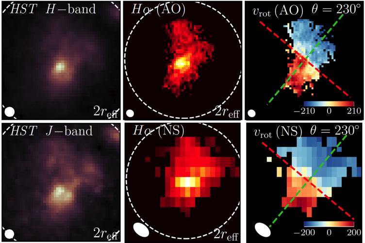
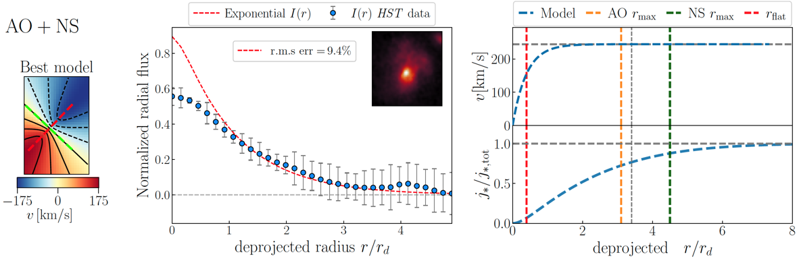

# CONDOR (COsmic Noon Dynamics with Optimised Resolutions)

Introduction
------------

CONDOR is a kinematic fitting code that finds the best kinematic model of a rotating disk galaxy by combining its high- and low-resolution velocity fields. The code is optimized for data acquired with facilities that use adaptive optics (AO) suchs as OSIRIS (Keck) and SINFONI (VLT) and their natural seeing counterparts (NS) with KMOS (VLT). This sample comprises galaxies in the range z~[1.5,2.5].

The code uses a "2.5D" strategy where input data is in 2D but the modelling happens in 3D. First, the code creates model datacubes which match the pixelscale of the input data and are convolved using the right shape of the PSF (Airiy Disk + Moffat in AO and Gaussian in NS). Model velocity fields are extracted from the cubes using an emisison line gaussian fit and then compared to the input data through a MCMC resampling method with _**emcee**_. The best kinematic model is thus the model that best represents the input data at both resolutions (or using the individual resolution if desired):

Finally, the code calculates the angular momentum content of the galaxy assuming an exponential disk for the surface brightness profile:

  

For more details on what CONDOR does, see: https://doi.org/10.1093/mnras/stab2755

Usage
-----

Some basic settings need to be applied in order to run the pipeline.

The basic workflow is as follows:

- The main script is called **_run_code.py_**. It contains the relevant paths and calls the necessary modules within CONDOR's structure. Make sure you run CONDOR at the location of this script.

- Set up a _**data_parameters.csv**_ file specifying the input parameters for the geometrical deprojection of the disk (inclination, position angle, size, pixelscale), as well as the kinematic parameters such as the "rflat" and "vflat" parameters which characterize the velocity field of the galaxy following a simple exponential disk. Note that these input parameters are merely a first guess that the code will use as priors for the mcmc resampling:

  

- The input data are .fits files with the 2D maps of the velocity fields with their corresponding errors, as well as the PSF of each dataset e.g. _**galaxy_vel_AO.fits**_, _**galaxy_vel_NS.fits**_, _**galaxy_velerr_AO.fits**_, _**galaxy_velerr_NS.fits**_, _**galaxy_PSF_AO.fits**_, _**galaxy_PSF_NS.fits**_.

Running the code ⚙️
--------

Once the main files (_**run_code.py**_, _**data_parameters.csv**_ and kinematic maps) are set up correctly, the code is run using: "python run_code.py ID data walkers steps type"

**ID** = galaxy identifier (depends on your own list of targets)

**data** = ["NS", "AO", "combined"]

**walkers** = number of walkers (integer)

**steps** = number of steps (integer)

**type** = ["plot","run"]

Examples
--------
To run the code for the natural seeing "NS" data only of galaxy with ID 34, with 150 walkers and 2000 steps, do:

    python run_code.py 34 NS 150 2000 run

To run the code combining the resolution, with 100 walkers and 1000 steps, for galaxy with ID 12, do:

    python run_code.py 12 combined 100 1000 run

To run the code for the adaptive optics "AO" data only of galaxy with ID 29, but only to plot previoulsy ran calculations, which simply reads the _**results.csv**_ file, do:

    python run_code.py 29 AO 150 2000 plot

Note that in the last example the number of walkers and steps are ignored so the input values don't have any effect. 

**Example: Deep3a-15504**

As an example of how the code works, here's the analysis of a star-forming galaxy at z~2.38 from the SINS survey. The data was taken at high- and low-spatial resolutions with the SINFONI IFU instrument at VLT targeting its Hα emission. Additionally, this galaxy has _HST_ H- and J-band photometry as shown in the figure below:

  

When running the combined analysis, the code saves the best-fit parameters in the _**results.csv**_ file and generates different figures for the user's assessment. These include the posterior distributions in corner plots, where you can investigate the covariances as in the following example:

It will also show you the residual maps (model - data) for user's assessment of the results:

At last, it will show you the model surface brightness profile of the galaxy (exponential profile in the simplest case) and calculate a cumulative angular momentum profile as shown below:

**NOTE:** Since this code has been optimized for a very specific set of data, setting everything up for your data might require some teaking in the code itself so please feel free to reach out to me if you  need help at jespejosalcedo@swin.edu.au

Further work
------------

Future versions might include:

- Multiple kinematic models.
- Complex modelling including bulge-disk decompositions.

Acknowledgements
---------------
CONDOR has been written as part of my PhD work at the Centre for Astrophysics and Supercomputing at
Swinburne University of Technology (2019-2022).

This package uses multiple python libraries including _scipy, astropy, emcee, matplotlib, pandas, itertools and numba_. The calculations perfomed in CONDOR are only possible thanks to the efforts of the multiple developers that have written these tools and libraries.
